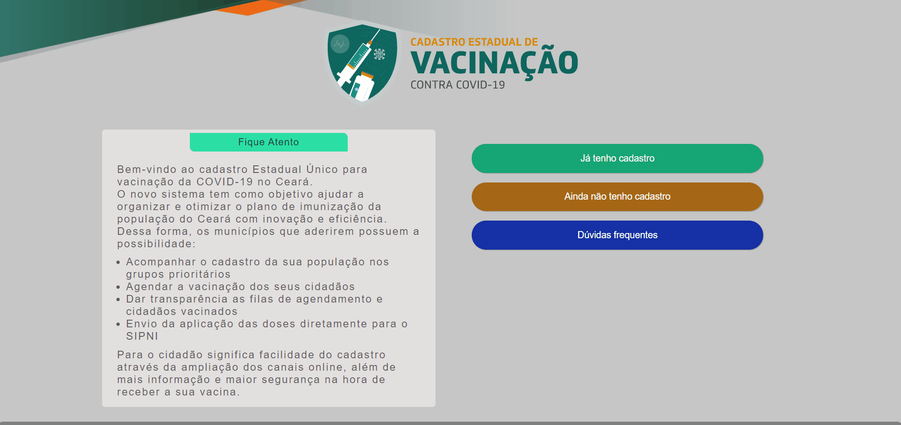
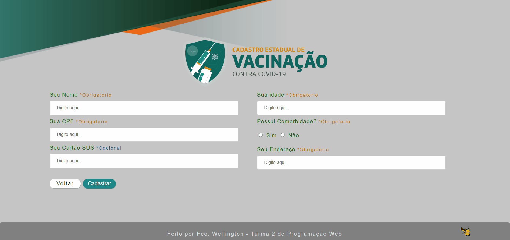

<h1 align="center">Cadastro de vacinação</h1>

Esse é um projeto recorende a uma atividade do meu curso de programalçao WEB, do qual era necessario fazer consultas e manipulação de dados de um banco de dados

 <a href="#caracteristicas">Características</a> •
 <a href="#pré-requisitos">Pré Requisitos</a> •
 <a href="#tecnologias">Tecnologias</a> •
 <a href="#autor">Autor</a>

---

 

### Características
<h1 align="center">
  <h1>Sistema de Listagem de cadastrados</h1>
  

  
  

  <h1>Sistema de Cadastro e Login</h1>
  

  
  

</h1>
   

### Pré-requisitos

Antes de começar, você vai precisar ter instalado em sua máquina as seguintes ferramentas:
[Git](https://git-scm.com), [XAMPP](https://www.apachefriends.org/pt_br/index.html).

Você também vai precisar configurar o ambiente phpmyadmin.

Além disto é bom ter um editor para trabalhar com o código como [VSCode](https://code.visualstudio.com/)

### Tecnologias

As seguintes ferramentas foram usadas na construção do projeto:

- [MySQL](https://www.mysql.com/)
- [PHP](https://www.php.net/)

---

### Autor

